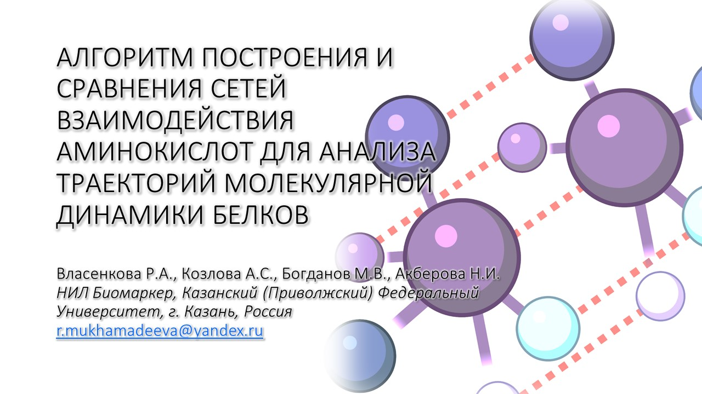
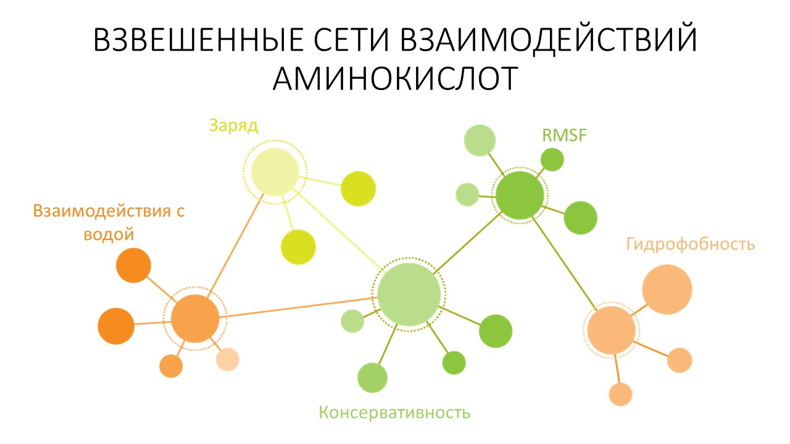
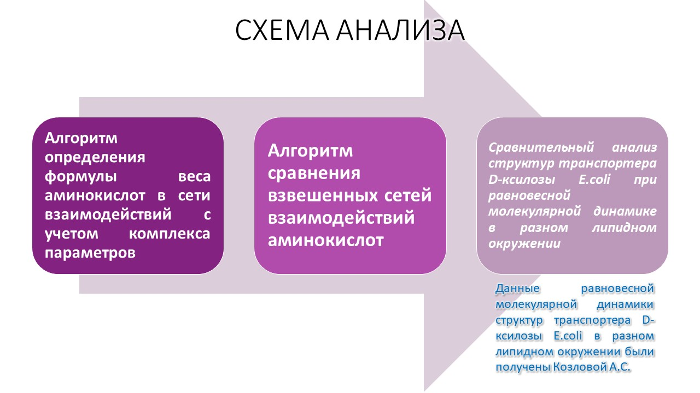
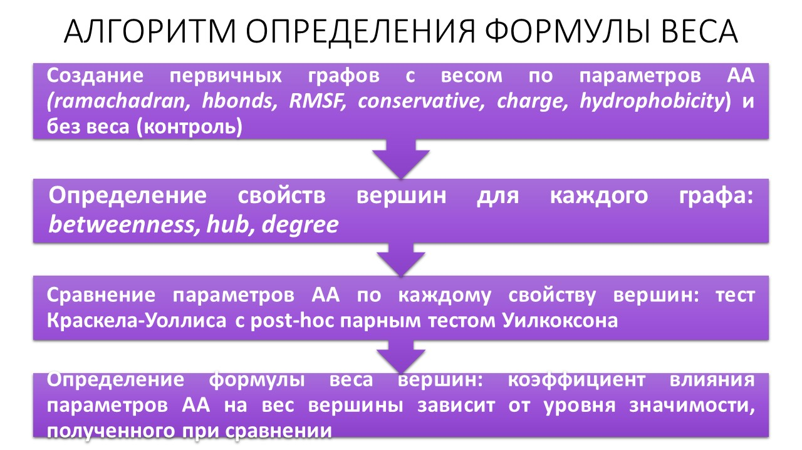
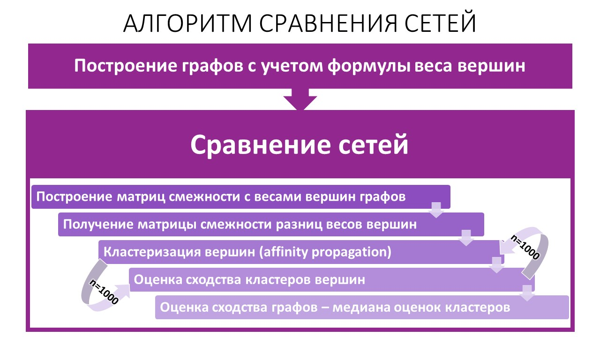
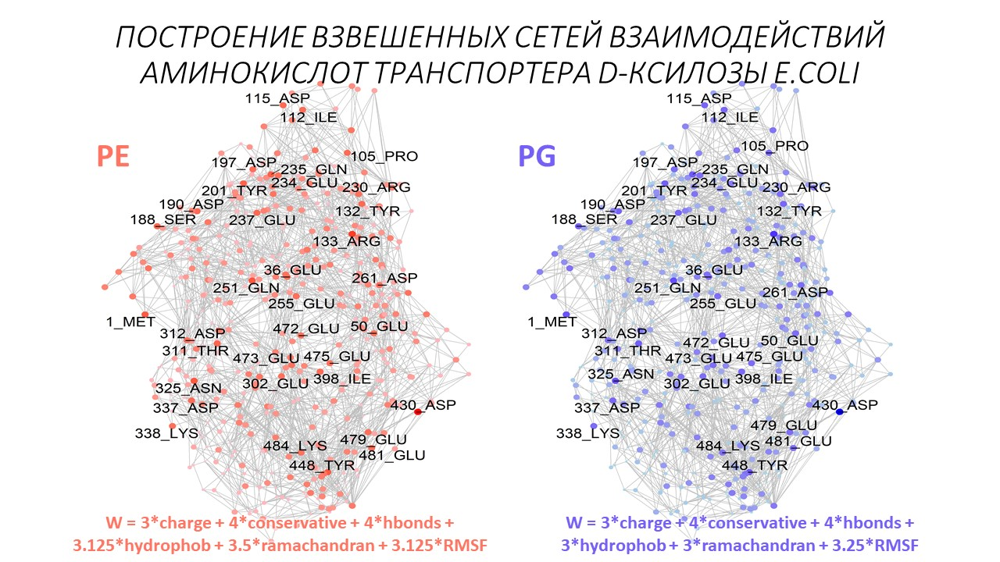
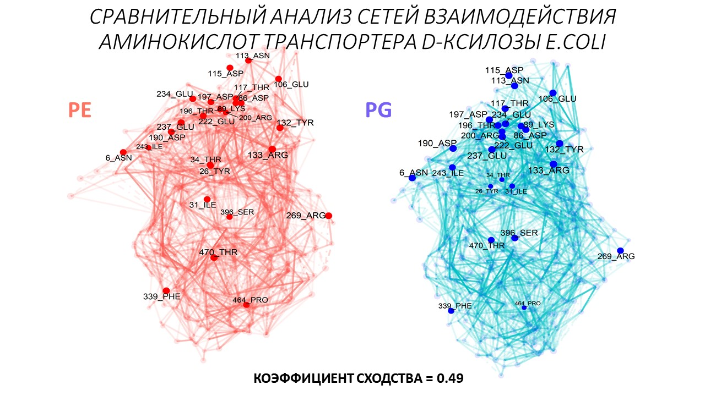

## Weighted Amino acid Network Illustrative Analysis - WANIA

Анализ и сравнение сетей взаимодействия аминокислотных остатков в пространственных структурах белков при проведении молекулярной динамики позволяет исследовать вклад определенных аминокислот как в структурную устойчивость, так и в конформационную подвижность белков.  При этом необходимо учитывать такие параметры аминокислот как консервативность, заряд, гидрофобность и другие свойства, обусловленные их физикой и химией.

_/Scripts/1_Weight_formula_MD.R_

Для учета всего комплекса параметров аминокислот при построении сетей в работе разработан алгоритм определения формулы веса вершины графа.  На первом этапе построены взвешенные графы, вес в которых определялся одним из следующих параметров – процент времени нахождения аминокислоты в запрещенных зонах, процент времени взаимодействия аминокислоты с водой, RMSF (root mean square fluctuation), консервативность аминокислоты, заряд, гидрофобность. Для контроля был также построен невзвешенный граф. Для каждого графа были определены следующие параметры вершин − степень вершины, степень посредничества, степень близости, центральность. Параметры вершин взвешенных графов были сравнены с аналогичными параметрами вершин контрольного невзвешенного графа с помощью теста Краскела-Уоллиса с попарным тестом Уилкоксона с поправкой на множественность сравнений. Коэффициент для каждого параметра аминокислот был рассчитан на основе уровня значимости, полученного при сравнении. Коэффициенты и значения параметров аминокислот определяют формулу веса вершины.

_/Scripts/2_Comparative_analysis.R_

Сравнение сетей взаимодействия аминокислот производилось на взвешенных графах, для вершин использовались веса, рассчитанные на предыдущем этапе анализа. Для сравнения были получены матрицы смежности с учётом полученных весов. На основе матриц смежности вершины выполнена кластеризация методом распространения близости. Оценка сходства каждого кластера определялась как среднее значение максимального сходства для каждой пары вершин между двумя графами. Оценка сходства графов рассчитывалась как медиана оценок сходства каждого кластера. Процедуры определения формулы веса вершины графов и сравнение графов были полностью автоматизированы.

_/Scripts/3_DXylose_transporter_comparison.R_

**Example** - Данный алгоритм позволил провести сравнительный анализ важных для структуры аминокислот транспортера D-ксилозы E.coli при равновесной молекулярной динамике в разном липидном окружении. 

