# Weighted Amino acid Network Illustrative Analysis - WANIA

## Motivation and Aim
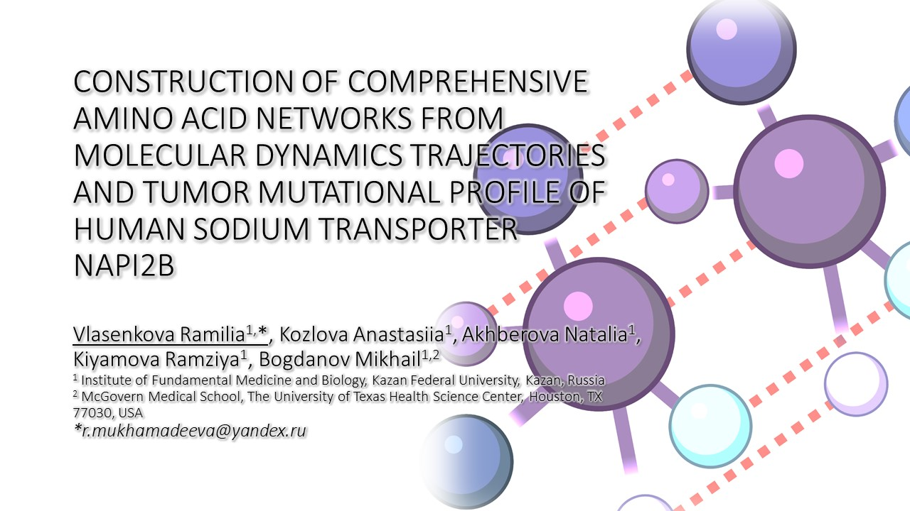

The active roles of individual amino acids across the proteome is determined by many factors including nearby amino acids, secondary structure, posttranslational modifications and interacting ligands. Moreover, chemical properties of individual amino acids are utilized in drastically different contexts to generate required functions: for example, cysteines can form either disulfide or hydrogen bonds or stay as free thiols while the charged amino acids can make or not use of their charge. Each tumor is characterized by a unique profile of mutated genes. If tumor mutational profile of the proteins is available, we can match these experimental readouts and capture the three-dimensional impact of intra-protein amino acids short and long-range interactions on the development of oncological diseases in the accordance with predicted altered protein activity or stability. In addition, the received information will allow us to develop more effective personalized therapeutic agents taking into account the individual mutational status of each patient. Comparison of the AAN (amino acid networks) with different molecular characteristics using Molecular Dynamics allows us to explore the contribution of certain amino acids to structural stability and conformational mobility of proteins. We tackled recently the mutation profiles of patients and identified 111 functionally significant mutations of the NaPi2b protein in tumor samples [1]. By mapping AANs within the tumor mutational landscape of the protein, we examined mutational consequences and scored deleterious cancer-related impact of a substitutions on the protein structure of NaPi2b.

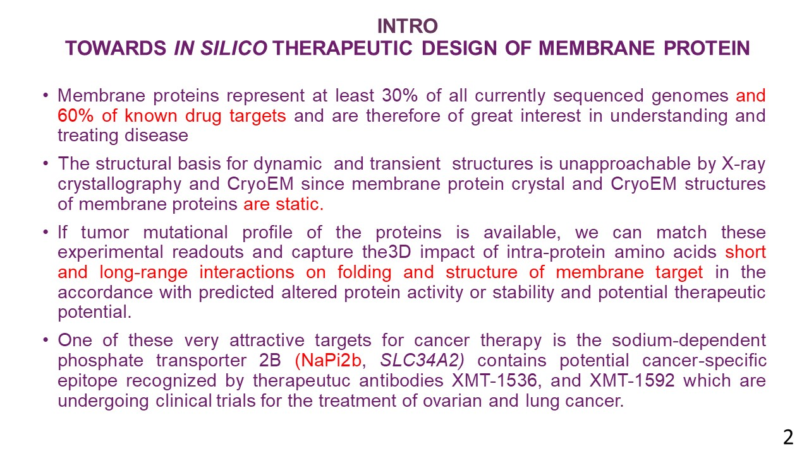

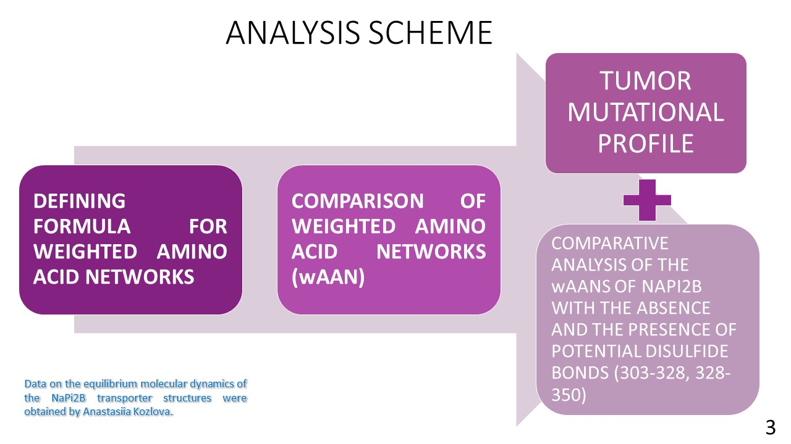

## Methods and Algorithms

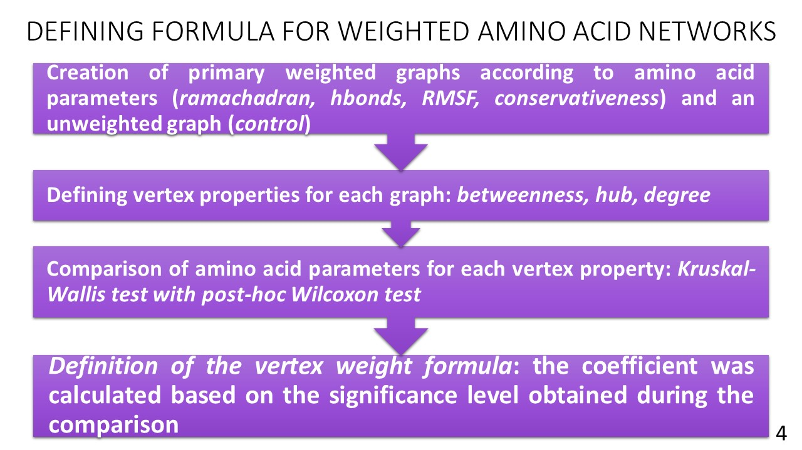

_/Scripts/1_Weight_formula_MD.R_

_/Scripts/2_Comparative_analysis.R_

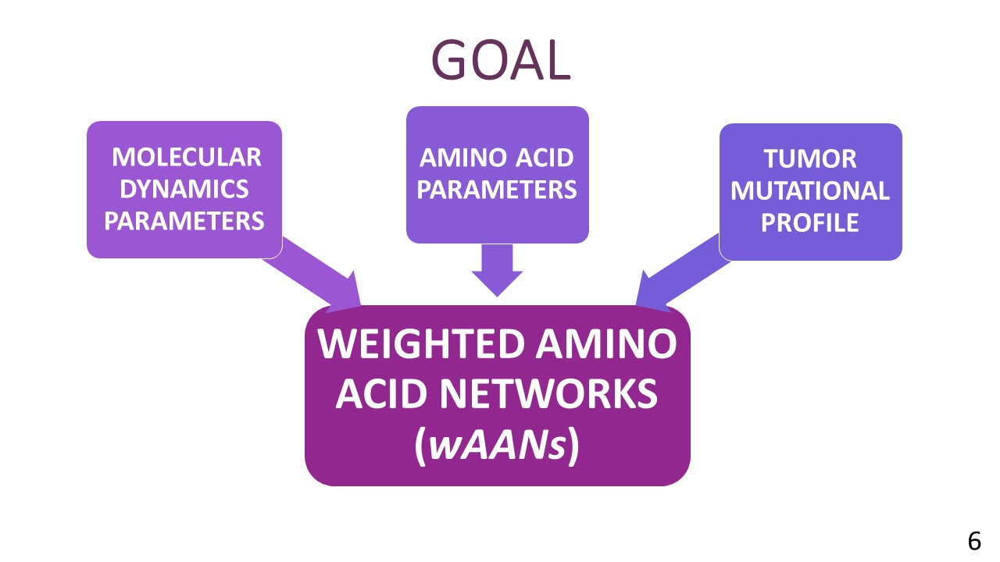

The NaPi2b structure was predicted ab initio and thermodynamically stabilized by the method of Molecular Dynamics. Disulfide bonds (aa 303-328, aa 328-350) were introduced by controlled Molecular Dynamics. Molecular Dynamics simulation was carried out using the NAMD program, Molecular Dynamics parameters were obtained using the bio3d R package and the VMD software. 
Considering the entire complex of amino acid parameters in the construction of networks, a new algorithm for determining the formula of the node weight has been developed. Weighted graphs were constructed, the weight in which was determined by one of the following likelihood parameters:  residence time for amino acid residue staying continuously in forbidden regions, residence time for amino acid residues interacted with water, RMSF (Root Mean Square Fluctuation), the average conservation of positions of each amino acid.
An unweighted graph was also constructed as a control graph. The parameters of the nodes of the weighted graphs were compared with similar parameters of the nodes of the control unweighted graph using the Kruskal-Wallis test with the pairwise Wilcoxon test adjusted for the multiple testing. The coefficient for each amino acid parameter was calculated based on the significance level obtained during the comparison. The coefficients and values of the parameters determine the weight formula.
To compare AANs adjacency matrices were obtained considering the obtained weights.  Assessment of interactions  clustering in NaPi2b structure is performed based on adjacency matrices using proximity propagation. The similarity score was calculated for each cluster. The similarity score of the graphs was calculated as the median of the similarity scores of clusters.
The set of mutations found in tumor samples were mapped on the obtained graphs. The procedures for determining the node weight formula, the graph comparison, and the mutation mapping were fully automated.

## Results

The developed robust clustering algorithm was utilized to conduct a comparative analysis of the AANs of NaPi2b with the absence and the presence of potential disulfide bonds (303-328, 328-350). The AANs of NaPi2b were mostly similar to each other, but the considerable difference was found between the control and the AAN with disulfide bond 303-328.

_/Scripts/4_NaPi2B_comparison.R_

### wAAN of NaPi2b with the absence and the presence of potential disulfide bonds (303-328, 328-350)

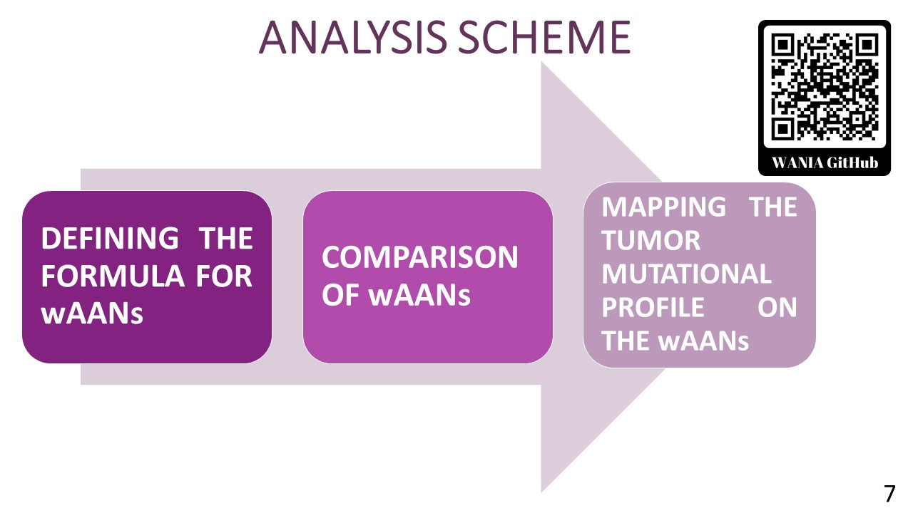

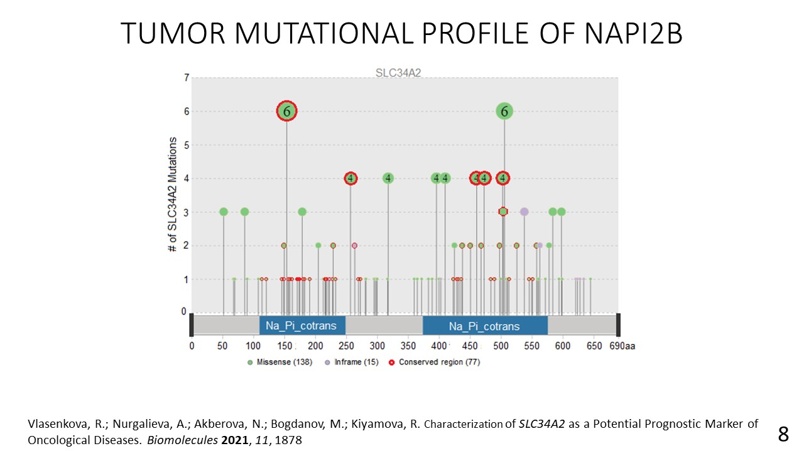

<iframe src="./interactive_network_mutation_upper25_3.html" style="border:none;width:700px;height:500px;"></iframe>

Additionally, we identified the amino acid residues from tumor mutational dataset and had the most impact on the structure of NaPi2b. Critical amino acid residues are located in one of the transmembrane domains (217ALA, 218THR, 221ASP, 224ASN), in the largest extracellular domain (297SER, 299VAL), in one of the two pseudosymmetrically located loops (163SER) comprising serine rich QSSS functional motifs within protein transport core, and in the N-domain (90LYS). Mutations in these sites were discovered in samples of oncological diseases of stomach, lung, bowel, liver and brain.

### Tumor mutational profile of NaPi2b

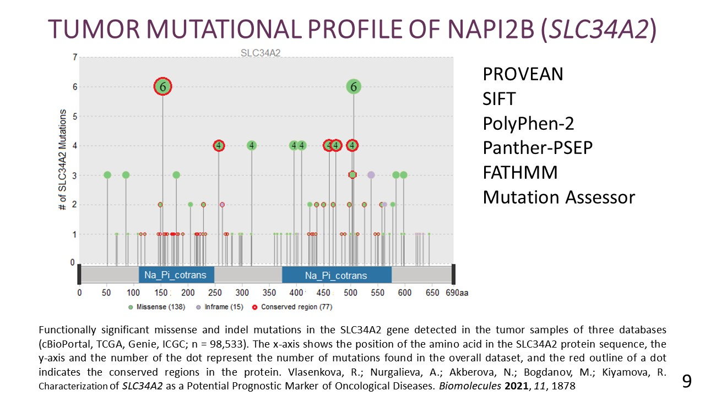

### Important amino acid residues in cancer

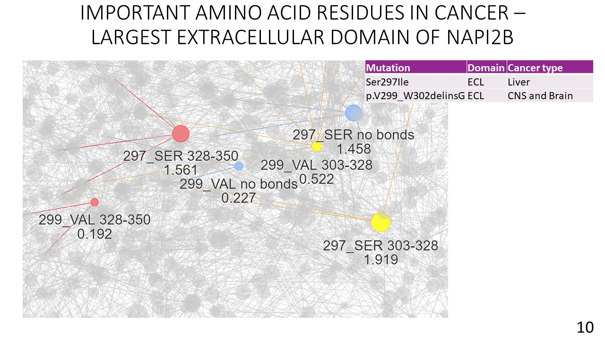

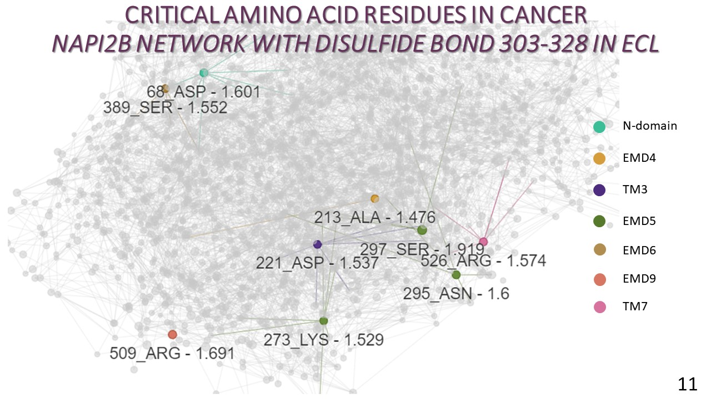

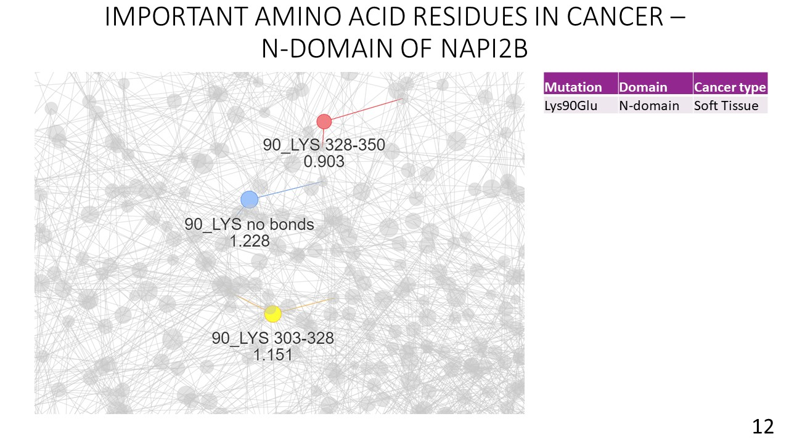

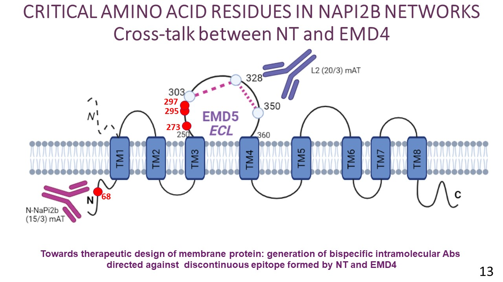

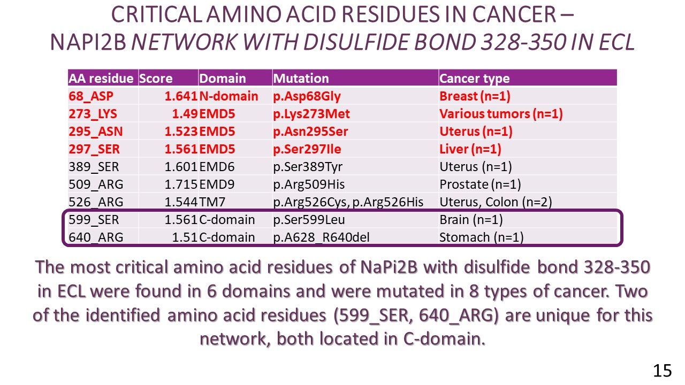

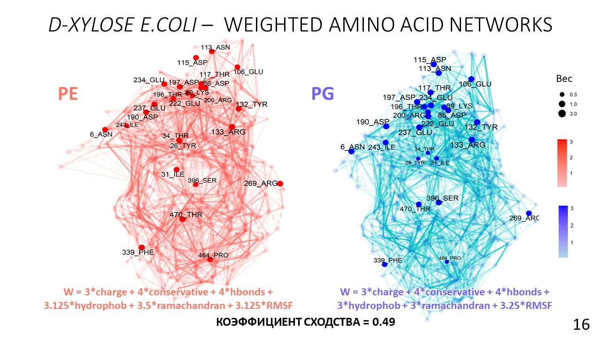

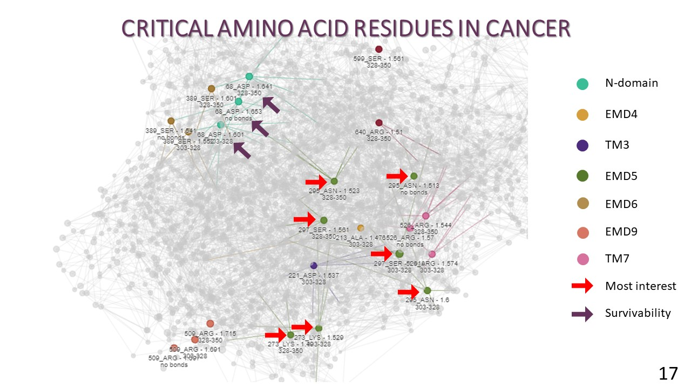

## Conclusion

The algorithm for determining the node weight formula, the graph comparison and the mutation mapping were developed and automated. And the comparative analysis of the AANs of NaPi2b with the absence and the presence of potential disulfide bonds were carried out, which results in the list of amino acid residues which were found altered in tumor samples and had the most impact on the structure of NaPi2b protein.

### Acknowledgement

## References

[Vlasenkova, R et al. (2021) Characterization of SLC34A2 as a Potential Prognostic Marker of Oncological Diseases. Biomolecules. 10.3390/biom11121878](https://www.mdpi.com/2218-273X/11/12/1878)

